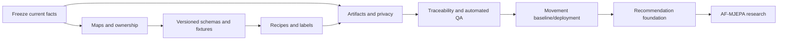
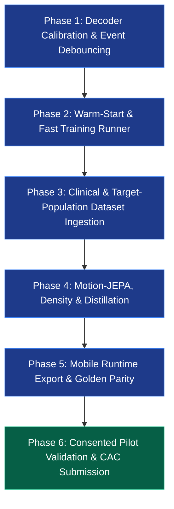
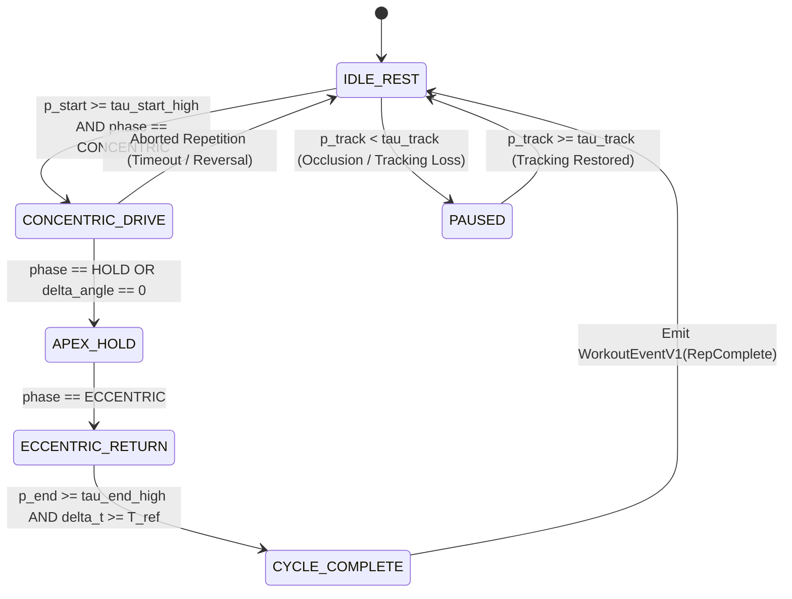
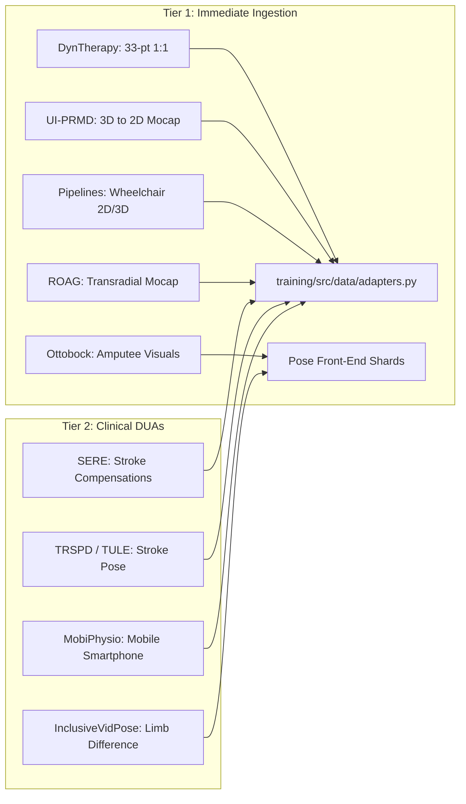
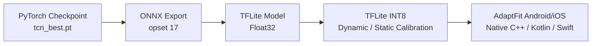
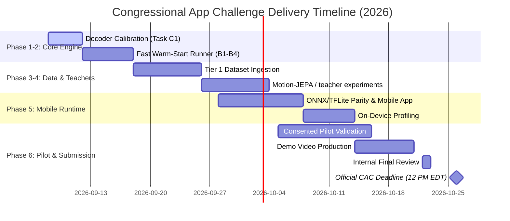

# AdaptFit: Implementation Plan and Master Roadmap Toward the Congressional App Challenge

> **Documentation metadata**
> - **Status:** canonical-active
> - **Authority:** exhaustive dependency-ordered engineering master plan and delivery roadmap
> - **Last verified:** 2026-09-08
> - **Source commit:** `ba8bf1a` (code baseline) / `1a46f38` (documentation revision base)
> - **Owner:** AdaptFit engineering & machine learning team
> - **Supersedes or supports:** canonical forward plan and engineering roadmap; supersedes earlier high-level implementation outlines
> - **Review trigger:** milestone completion, dependency change, gate result, or empirical evidence

Planning review: September 8, 2026. Audited model checkout: `ba8bf1a` (code baseline), `1a46f38` (documentation revision base and repository HEAD before this working-tree update).

---

## Executive Summary & Product Vision

AdaptFit is an anatomy-informed, on-device movement adaptation and repetition tracking system designed specifically for individuals with bodily limitations:
1. **Upper-limb differences / single-arm users** (transradial/transhumeral amputations, hemiparesis, brachial plexus injuries).
2. **Lower-limb differences / single-leg users** (transtibial/transfemoral amputations, single-leg functional mobility).
3. **Wheelchair and seated users** (manual wheelchair users, spinal cord injuries, seated fitness).

The core product delivers an autonomous, offline workout loop:
$$\text{Self-Reported Capabilities \& Equipment} \longrightarrow \text{Compatible Routine Assembly} \longrightarrow \text{Camera-Assisted Exercise} \longrightarrow \text{Causal Repetition Tracking \& Form Feedback} \longrightarrow \text{Equipment Substitution} \longrightarrow \text{Verified Progress Logging}$$

The first-release scope covers **five seated, unilateral-friendly rehabilitation exercises**:
- One-Arm Bicep Curl (unilateral upper-arm flexion)
- One-Arm Band Row (unilateral scapular retraction & pull)
- Seated Single-Leg Knee Extension (unilateral lower-leg extension)
- Seated Single-Leg March (unilateral hip flexion)
- Seated Forward Reach (unilateral/bilateral functional reaching & trunk stabilization)

---

## Documentation context pass (current prerequisite)

Before changing the movement model, recommendation code, or deployment path,
complete the documentation context work in this order:

| Work package | Objective | Prerequisites | Expected artifact | Acceptance/stop condition |
|---|---|---|---|---|
| D0: freeze facts | Reconcile code, configs, manifests, checkpoints, and reports | clean read-only inventory | dated current-state and artifact entries | stop when any metric/path lacks evidence |
| D1: navigation maps | Connect runtime flow, source files, tests, owners, and model lifecycle | D0 | system context, repository map, model registry | no subsystem has two active authorities |
| D2: executable contracts | Make interfaces versioned with valid/invalid fixtures | D1 | JSON schemas, examples, compatibility matrix | reject mismatched versions and invalid edge cases |
| D3: recipe and label protocol | Lock approval states, launch recipes, labels, masks, and adjudication | D2 | recipe registry and annotation handbook | no recipe/label is promoted without human review |
| D4: evidence and operations | Trace artifacts, privacy, failures, and test coverage | D0–D3 | artifact, privacy, failure, and test matrices | missing evidence remains unavailable; no claim inflation |
| D5: traceability and QA | Map requirements to gates and automate structural checks | D1–D4 | requirements ledger plus docs validator/CI job | validator passes and human safety/privacy review signs off |

The implementation priority after this pass remains **movement baseline and
deployment facts → recommendation foundation → AF-MJEPA research**. A research
proposal cannot unlock downstream implementation merely because its document
exists.



The detailed cross-subsystem references live in [system context and data
flow](system-context-and-dataflow.md), [repository and implementation map](repository-and-implementation-map.md),
and [requirements traceability](requirements-traceability.md).

---

## What Exists vs. What Remains Unproven

| Subsystem | Verified Current State | Identified Empirical Bottleneck | Master Plan Solution & Next Action |
|---|---|---|---|
| **Pose Landmarks** | Canonical 33-joint 2D layout normalized around hip midpoint and torso scale | Optical mocap datasets (Vicon/Qualisys) are in 3D millimeters | Standardized 3D-to-2D virtual camera projection pipeline |
| **Feature Pipeline** | 283 ordered features (`training/src/features/anatomy.py`): angles, velocities, masks, capability context | Normalization assumes intact bilateral body by default | Explicit capability weights ($w_c \in \{1.0, 0.8, 0.65, 0.5, 0.0\}$) modulate confidence and zero out absent anatomy |
| **Model Architectures** | Causal Dilated TCN (307,410 params; 5 blocks); Causal GRU (68,178 params; 1 layer) | TCN receptive field is strictly 125 frames (~4.16s at 30 FPS) | Separate long-horizon count state machine from fixed-context backbone |
| **Repetition Counting** | Repetition Start F1: **66.96%–99.54%**; Repetition End F1: **12.26%–18.47%** | Naive per-frame accumulation $\sum p_{end}(t)$ causes severe overcounting | **Phase 1**: Phase-Coupled Finite State Machine with dual hysteresis |
| **Training Pipeline** | Overnight 72-epoch TCN trained; GRU interrupted at epoch 52 | Full retraining requires 18 hrs across 267k windows; no warm-start | **Phase 2**: Event-weighted sampler (hypothesized $\sim 4.4\times$ speedup) + warm-start runner |
| **Quality Supervision** | 4-dimensional quality heads (`quality_logits`) have **0% labeled coverage** in v1/v2 | UCO composite score is 1-5 scalar, not dimension-specific | **Phase 3**: Ingest SERE, TRSPD, and KERAAL clinical compensation labels (UI-PRMD correctness remains masked from dimension-specific quality heads; frame-level annotations require window aggregation contracts to align with pooled `quality_logits`) |
| **Workout Recommendation** | Capability profile and recipe schema exist; no complete selector or history model | No eligible-candidate service, feedback dataset, or neural ranker | **Cross-cutting track**: hard feasibility mask → content/rules baseline → consented feedback logging → optional neural personalization |
| **Teacher / World Model** | Supervised baseline only; no teacher or JEPA checkpoint integrated | Boundary jitter and possible representation transfer gap | **Phase 4**: optional AF-MJEPA latent pretraining or one task-specific teacher, selected by measured failure |
| **Mobile Deployment** | Python causal streaming runtime (`CausalStreamingRuntime`) passing unit tests | Native Android/iOS MediaPipe feature bridge and on-device runtime unbuilt | **Phase 5**: Planned ONNX / TFLite INT8 export + 6 golden fixture parity tests (planned) |
| **Target Validation** | Tested on public datasets (REHAB24-6, IntelliRehabDS, MM-Fit, UL-RED, UCO) | Zero validation on real amputee, wheelchair, or stroke participants | **Phase 6**: Consented $N=10\text{–}15$ pilot study + Congressional App Challenge delivery |

---

## The Exhaustive 6-Phase Engineering Master Roadmap



---

### Phase 1: Decoder Calibration & Event Debouncing (Task C1)

**Owner: Machine Learning Team | Priority: Immediate (Sprint 1)**  
**Status: Ready for Implementation | Prerequisites: Evaluated `v2-quality-fixed` checkpoint**

#### 1. Root Cause Diagnosis
In `training/src/metrics.py#L285-L287`, the current repetition counter computes counts by summing per-frame boundary logits:
```python
# Flawed accumulator in metrics.py
pred_counts = (seq_pred[:, 1] > threshold).sum().item()
```
Because the causal TCN emits positive end logits across consecutive frames (e.g. 5–15 frames during the eccentric phase inflection), this raw accumulation causes catastrophic overcounting: a single 10-repetition workout set can register 80–150 false repetitions.

#### 2. Phase-Coupled Finite State Machine (FSM) Specification
To enforce biological periodicity, the counting decoder is formulated as an asynchronous finite state machine coupled with the model's per-frame phase probabilities:



#### 3. Mathematical State Transition Rules
Let $p_{start}(t)$, $p_{end}(t)$, $p_{phase}(t) \in [0, 1]^5$, and $p_{track}(t) \in [0, 1]$ denote the model outputs at frame $t$. All threshold and refractory values below represent **initial search defaults / starting heuristic bounds** for Task C1 grid search until Task C1 execution produces a committed, locked `artifacts/calibrated_decoder_v1/fsm_params.json` artifact:

1. **Dual-Threshold Hysteresis for Start Trigger**:
   - Transition from `IDLE_REST` to `CONCENTRIC_DRIVE` requires:
     $$p_{start}(t) \ge \tau_{start\_high} \quad (\text{initial search default: } 0.65) \quad \text{AND} \quad \arg\max p_{phase}(t) \in \{\text{concentric}, \text{hold}\}$$
   - Hysteresis releases only when $p_{start}(t) < \tau_{start\_low} \quad (\text{initial search default: } 0.35)$.

2. **Dual-Threshold Hysteresis for End Trigger**:
   - Transition from `ECCENTRIC_RETURN` to `CYCLE_COMPLETE` requires:
     $$p_{end}(t) \ge \tau_{end\_high} \quad (\text{initial search default: } 0.45) \quad \text{AND} \quad \arg\max p_{phase}(t) \in \{\text{eccentric}, \text{rest}\}$$
   - Hysteresis releases only when $p_{end}(t) < \tau_{end\_low} \quad (\text{initial search default: } 0.25)$.

3. **Temporal Refractory Period ($T_{ref}$)**:
   - A minimum repetition cycle time $T_{ref} = 24\text{ frames}$ ($0.80\text{ seconds}$ at 30 FPS, initial search default) is evaluated. If $t_{end} - t_{start} < T_{ref}$, the event is classified as motion jitter and discarded.

4. **Local Peak Filter**:
   - The end event is emitted only at the local temporal maximum within a sliding window of radius $W=2$ frames:
     $$p_{end}(t) = \max_{k \in [-2, +2]} p_{end}(t+k)$$

5. **Tracking Observability Gating**:
   - If tracking confidence $p_{track}(t) < \tau_{track}$ (initial search default: $0.60$), the state machine enters `PAUSED`. State transitions are frozen, preventing spurious counts during camera occlusion or framing loss. When tracking recovers, a 5-frame stabilization warmup is enforced before resuming.

#### 4. Grid-Search Optimization Protocol
- **Search Space**:
  - $\tau_{start\_high} \in [0.50, 0.85]$ (step 0.05)
  - $\tau_{end\_high} \in [0.30, 0.65]$ (step 0.05)
  - $T_{ref} \in [15, 36]$ frames (step 3 frames / 0.1s)
  - $\tau_{track} \in [0.40, 0.75]$ (step 0.05)
- **Validation Target**: Replay inference over all 16,483 validation windows prepared in `data/processed-v2-quality/` (`validation/*.npy` memmaps and `validation.jsonl`) using `artifacts/v2-quality-fixed/checkpoints/tcn_best.pt`. (Note: `artifacts/v2-quality-fixed/evaluations/tcn_validation.json` does not exist; existing evaluation artifacts in `artifacts/v2-quality-fixed/metrics/tcn_evaluation.json` represent test split results only). The 7,536-window (1,007-sequence) test split must remain strictly locked and unpeeked during decoder calibration to prevent evaluation leakage and protect test set integrity. Calibration outputs will be locked to `artifacts/calibrated_decoder_v1/fsm_params.json`.
- **Exit Gate**: Repetition Count MAE $\le 0.40$ (reducing validation count error by $>80\%$) and Sequence-Level Repetition End F1 $\ge 60.0\%$ evaluated on the validation split.

---

### Phase 2: Warm-Start & Fine-Tuning Runner Implementation (Tasks B1–B4)

**Owner: Machine Learning Team | Priority: High (Sprint 1)**  
**Status: Pending (blocked on Phase 1 calibration) | Prerequisites: Phase 1 calibration**

#### Task B1: Safe Warm-Start Weight Loading
Implement `load_pretrained_backbone` in `training/src/runner.py`:
```python
def load_pretrained_backbone(model: nn.Module, checkpoint_path: str | Path, freeze_backbone: bool = False) -> dict[str, int]:
    checkpoint = torch.load(checkpoint_path, map_location="cpu", weights_only=False)
    state_dict = checkpoint.get("model_state_dict", checkpoint)
    model_dict = model.state_dict()
    
    loaded_keys, skipped_keys = [], []
    for k, v in state_dict.items():
        if k in model_dict and model_dict[k].shape == v.shape:
            model_dict[k] = v
            loaded_keys.append(k)
        else:
            skipped_keys.append(k)
            
    model.load_state_dict(model_dict, strict=False)
    if freeze_backbone:
        for name, param in model.named_parameters():
            if not any(head_name in name for head_name in ["heads", "density"]):
                param.requires_grad = False
                
    return {"loaded": len(loaded_keys), "skipped": len(skipped_keys)}
```

#### Task B2: Trainable-Layer Selection & Exact Resumption Checkpoints
- Support three fine-tuning regimes via `--fine-tune-mode`:
  1. `heads_only`: Freezes all 5 TCN dilated residual blocks; updates only output heads (fast adaptation in <30 min).
  2. `last_block`: Freezes TCN blocks 0–3; updates residual block 4 and all output heads (preserves low-level kinematic primitives while adapting high-level temporal dynamics).
  3. `full_backbone`: Discriminative learning rates ($2 \times 10^{-5}$ for backbone, $1 \times 10^{-4}$ for heads).
- Checkpoint serialization stores: `model_state_dict`, `optimizer_state_dict`, `scheduler_state_dict`, `best_metric_score`, `epoch`, and `label_policy_version`.

#### Task B3: Redundant Work Reduction via Event-Weighted Sampler (Planned)
- **Bottleneck Hypothesis**: `data/processed-v2-quality/` contains 267,440 training windows. Initial inspection suggests a working hypothesis that $>65\%$ of these windows capture steady-state rest periods between exercise sets (pending formal verification against a committed dataset distribution audit artifact).
- **Proposed Solution**: Implement planned `EventWeightedWindowSampler` in `training/src/data/samplers.py` (planned; not yet implemented in repository).
  - Windows within $t \in [t_{start} - 8, t_{end} + 8]$ (active repetitions) sampled at stride 4.
  - Windows during sustained rest sampled at stride 32.
  - Hypothesized to reduce active training volume from 267k windows to ~60k windows.
  - **Hypothesized Speedup**: Hypothesized to yield an estimated up to $4.4\times$ reduction in per-epoch training time (projected from 15 minutes/epoch down to ~3.4 minutes/epoch on Apple Silicon MPS, targeting a 100-epoch run in ~5.5 hours instead of 25 hours). This speedup is an engineering hypothesis that must be benchmarked and evidenced with a committed timing artifact before marking Phase 2 complete.

#### Task B4: Bounded Experiment Configuration (Planned)
Create `training/configs/experiments/warmstart_fine_tune.yaml` (planned) with explicit learning rate schedules, gradient clipping ($1.0$), and early stopping patience (15 epochs on validation count MAE).

---

### Phase 3: Clinical & Target-Population Dataset Ingestion

**Owner: Data Engineering Team | Priority: High (Sprint 2)**  
**Status: Blueprint Specified | Authority: `docs/dataset-catalog.md` & `docs/dataset-expansion-plan.md`**



#### Step-by-Step Acquisition Sequence

1. **DynTherapy (Priority 1, Sprint 1)**:
   - Propose ingesting 33 MediaPipe keypoints from Mendeley Data (CC BY 4.0).
   - Direct 1:1 drop-in adapter in `training/src/data/adapters.py#load_dyntherapy`.
   - Supplies verified repetition start/end boundaries and phase labels across 7 PT exercises.

2. **UI-PRMD (Priority 1, Sprint 1)**:
   - Propose ingesting 10 PT exercises with dual Vicon/Kinect data.
   - Project 3D markers to canonical 2D via virtual camera projection ($d=2.0\text{m}, h=1.0\text{m}$).
   - Maps repetition cycle boundaries and exercise family labels; dimension-specific quality heads remain strictly masked (`quality_mask = 0.0`, target `-1`). UI-PRMD provides overall movement correctness ("optimal" vs. "non-optimal"), which must NOT be mapped into dimension-specific ROM (`quality[:, 0]`) or trunk compensation (`quality[:, 3]`) heads per the feature contract and `dataset-expansion-plan.md`.

3. **Pipelines Open Dataset (Priority 1, Sprint 1)**:
   - Propose ingesting synchronized wheelchair propulsion cycles.
   - Maps push/recovery timestamps to concentric/eccentric phases.
   - Establishes wheelchair camera-to-mocap benchmark.

4. **ROAG (Priority 1, Sprint 1)**:
   - Propose ingesting 2 transradial amputee reaching trajectories (2,450 trials).
   - Maps reach geometry and torso lean to single-arm capability profiles and thresholded binary trunk compensation quality (applying an initial tunable candidate threshold $\theta_{trunk} \ge \tau_{trunk} \approx 15^\circ$ (subject to empirical calibration) and a temporal window aggregation contract to prevent a schema mismatch with the binary classification head `quality_logits[:, 3]`).

5. **Ottobock #DearAI Community Library (Priority 1, Sprint 1)**:
   - Propose ingesting community imagery of upper-limb and lower-limb amputees.
   - Evaluates MediaPipe landmark confidence and capability weights ($w_c$) to prevent phantom limb hallucination.

6. **SERE & TRSPD / TULE (Priority 2, Sprint 2)**:
   - Submit research DUA to VisLab Lisbon (`ana.coias@tecnico.ulisboa.pt`).
   - Propose ingesting 18–20 post-stroke 3D skeletons with therapist-graded trunk lean and shoulder hiking annotations, applying a temporal window aggregation contract to populate the pooled trunk compensation head or keeping them masked.

---

### Cross-cutting Product Track: Recommendation & Routine Assembly

**Owner: Product, data, and ML engineering | Priority: High for workout selection, independent of the movement-model training path**
**Status: Rules and recipe foundation required; neural ranker not implemented**

The recommendation system is separate from the TCN/GRU movement model. It must
run the hard feasibility mask over reviewed `ExerciseRecipeV1` records before
any ranking. Its dependency order is:

1. Add reviewed goal, difficulty, movement-pattern, duration, and substitution
   metadata to the recipe catalog.
2. Implement `EligibleRecipeSetV1` with capability, posture, equipment,
   movement-avoidance, camera-mode, and recipe-approval checks.
3. Ship a transparent content/rules ranking baseline with empty-candidate,
   manual-selection, and explicit-confirmation behavior.
4. Add consented, local-first `WorkoutFeedbackEventV1` logging with user/time
   splits and reason codes.
5. Compare a small user/context-to-exercise ranker against the rules baseline.
   Add personalization only if the held-out behavior and constraint gates pass.

Expected artifacts are a recipe catalog hash, feasibility fixtures, ranked
recommendation fixtures, feedback-event manifest, and a recommendation
experiment record. A neural ranker is blocked until eligible exposure data,
recipe versions, and a future-period holdout exist. Stop and use rules/manual
fallback if the ranker increases constraint violations, unexplained swaps,
subgroup disparity, or repetitive routines. Full contracts and metrics are in
[recommendation-model-plan.md](recommendation-model-plan.md).

### Phase 4: Motion-JEPA Pretraining, Repetition Density & Teacher Distillation

**Owner: Machine Learning Research | Priority: Medium (Sprint 3)**  
**Status: Research backlog | No JEPA, density, or teacher implementation exists**

#### 0. Capability-Conditioned Motion-JEPA (AF-MJEPA) proposal

AF-MJEPA is an optional, offline pose representation/world-model experiment.
It predicts future or masked **latent movement states** from canonical 33-joint
pose, confidence/observed masks, capability profile, posture, exercise, and
equipment context. It does not reconstruct pixels, replace the 283-feature
causal TCN, infer disability, or run on the phone.

The first pilot should compare approximately 10M, 20M, and 40M total training
models, with past-to-future latent prediction as the primary objective. Temporal
interval masking, joint/anatomy masking, and paired-view consistency are
optional ablations. The target encoder must use an explicit EMA or
stop-gradient rule, and the run must include collapse/finite-value checks.

Prerequisites are a reproducible C1 decoder/baseline result, a licensed and
participant-split pretraining manifest, and a versioned masking/loss/compute
configuration. The student keeps the existing 283-feature input and reliable
supervised losses. Accept AF-MJEPA only if a matched held-out sequence or
robustness metric improves without count, phase, abstention, subgroup, or
causal-streaming regressions. The detailed research contract is in
[motion-jepa-world-model-plan.md](motion-jepa-world-model-plan.md).

#### 1. Student Repetition Density Head Architecture
Extend `MultiTaskHeads` in `training/src/models/heads.py`:
```python
# In MultiTaskHeads.__init__:
self.density = nn.Linear(channels, 1)

# In MultiTaskHeads.forward:
density_raw = self.density(sequence).squeeze(-1)  # Shape: [batch, time]
outputs["density"] = F.softplus(density_raw)      # Guarantees non-negative density mass
```

#### 2. Continuous Density Loss Formulation
For a sequence window $[0, T]$ with predicted density $\hat{d}(t)$ and ground-truth density $d^*(t)$:
$$\mathcal{L}_{density} = \frac{1}{T} \sum_{t=1}^T |\hat{d}(t) - d^*(t)| + \lambda_{count} \left| \sum_{t=1}^T \hat{d}(t) - C^* \right|$$
where $C^*$ is the exact integer repetition count in the window, and $\lambda_{count} = 0.5$. Continuous repetition counting on live streams is obtained simply by integrating density over time:
$$\text{Count}(T) = \left\lfloor \int_0^T \hat{d}(t) \, dt + 0.5 \right\rfloor$$

#### 3. Teacher Distillation Roles & Interfaces

| Teacher Candidate | Reference & Repository | Input Modality & Joints | Distilled Target & Loss Function | Stage & Selection Gate |
|---|---|---|---|---|
| **AF-MJEPA (planned)** | [Motion-JEPA plan](motion-jepa-world-model-plan.md) | Canonical 33-joint pose/time tokens plus capability, posture, exercise, and equipment context | Future/masked latent states and optional soft task targets; latent distance and task losses are experiment-configured | **Representation candidate**: matched student improves a held-out product metric without collapse or streaming/subgroup regression |
| **SSTRAC** | Lim et al., *IEEE Access* (2025)<br>`imjjun/SSTRAC_public` | 2D/3D skeleton sequences (17 joints) | **Continuous Repetition Density Map**: Distills frame-level density $\hat{d}_{teacher}(t)$ via L1 loss | **First Candidate**: Gate: Count MAE improves over supervised baseline on RepCount-pose |
| **PoseRAC** | Yao et al., *CVPR* (2023)<br>`MiracleDance/PoseRAC` | BlazePose 33-joint sequences | **Salient-State Apex Logits**: Distills inflection point probabilities via KL-divergence | **Second Candidate**: Gate: End F1 improves without increasing count MAE |
| **RACNet** | Luo et al., *ECCV* (2024)<br>`Luoadore/RACnet` | Video feature sequences | **Cycle-Start Probabilities**: Distills full-resolution start-logit probabilities | **Third Candidate**: Optional ablation for cycle initialization |
| **MotionBERT** | Zhu et al., *ICCV* (2023)<br>`Walter0807/MotionBERT` | 17-joint 2D pose + confidence | **Latent Biomechanical Embeddings**: MSE loss between projected student features and frozen MotionBERT latents | **Auxiliary Only**: General motion prior; does not run on mobile |

#### 4. Offline Teacher Caching Pipeline & Distillation Modules (Planned)
- Teacher loss wrappers, student trainers, and caching scripts will be implemented under `training/src/distill/` (planned module; currently unavailable in repository).
- Teachers are evaluated offline over training sequences. Outputs are stored in `.npz` files indexed by `sequence_id` under `data/teacher_cache/` (planned cache directory; currently unavailable in repository):
  ```text
  data/teacher_cache/
  ├── af_mjepa/
  │   ├── manifest.json (model/config/split/mask hashes)
  │   └── seq_{sequence_id}.npz (latent or soft targets)
  ├── sstrac_density/
  │   ├── manifest.json (model hash, git commit, timestamp)
  │   └── seq_{sequence_id}.npz (density: float32 [T])
  └── poserac_salient/
      ├── manifest.json
      └── seq_{sequence_id}.npz (salient_logits: float32 [T, 2])
  ```
- Strict split boundaries: Teacher targets are computed **only for the training split**. Validation and test splits evaluate ground-truth labels exclusively.

---

### Phase 5: Mobile Runtime Export & Golden Parity Verification

**Owner: Mobile & Runtime Team | Priority: High (Sprint 3–4)**  
**Status: Pending (Planned Export Pipeline) | Target Devices: Android (Pixel 7 / Galaxy A54), iOS (iPhone 13+)**

#### 1. Export Pipeline & Quantization Architecture


- **Export Script (Planned)**: Planned script `training/src/export/export_mobile.py` (planned; not yet implemented in repository) will export the causal TCN with a fixed streaming state buffer:
  - Input: Current frame features $[1, 1, 283]$ + internal causal buffer $[1, 96, 125]$.
  - Output: Multi-task predictions + updated buffer $[1, 96, 125]$.
- **Post-Training Quantization (PTQ, Planned)**: Planned calibration using 1,000 representative validation windows (planned procedure; not yet executed).
- **Mobile Client Integration (Planned)**: Mobile application shell and native runtime bindings will be integrated under `apps/mobile/` (planned module in external repository; currently unavailable in this model repository).

#### 2. Golden Fixture Test Matrix (Planned)
Six canonical test vectors will be serialized to `training/tests/fixtures/golden_parity/` (planned test fixtures; currently unavailable in repository):
1. **Vector 1: Bilateral Standing Curl** (Symmetric intact movement).
2. **Vector 2: Unilateral Seated Curl** (Left arm active, right arm absent/capability zeroed).
3. **Vector 3: Unilateral Seated Band Row** (Single-arm pull with trunk stabilization).
4. **Vector 4: Seated Wheelchair Knee Extension** (Seated posture, lower-leg extension).
5. **Vector 5: Seated Wheelchair Forward Reach** (Trunk flexion and shoulder elevation).
6. **Vector 6: Camera Occlusion / Dropped Frames** (Tracking loss and recovery).

#### 3. Planned Parity Tolerances & Runtime Acceptance Criteria

All calibration, parity, latency, memory, and thermal numbers below represent **planned acceptance criteria and target quality gates**, not measured benchmark results. No mobile export, native bridge, or on-device benchmark has been executed yet in this repository.

| Dimension / Metric | Planned Acceptance Criterion (Target Gate) | Rejection / Failure Condition |
|---|---|---|
| **Float32 Parity (Planned)** | Target tolerance: $\max |\hat{y}_{py} - \hat{y}_{onnx}| < 1 \times 10^{-4}$ | Any logit divergence $> 1 \times 10^{-3}$ |
| **INT8 Quantized Parity (Planned)** | Target tolerance: $\max |\hat{y}_{py} - \hat{y}_{int8}| < 0.05$ | FSM event trigger mismatch on golden fixtures (planned) |
| **Event Alignment (Planned)** | Target: 100% agreement on Repetition Start and End timestamps | $\ge 1$ skipped or extraneous repetition event |
| **Camera-to-Display Latency (Planned Budget)** | Target budget: $\mathbf{p50 < 45\text{ms}}, \quad \mathbf{p95 < 95\text{ms}}$ | p95 latency $> 150\text{ms}$ at 30 FPS |
| **Memory Footprint (Planned Budget)** | Target budget: Peak RAM consumption $\mathbf{< 25\text{MB}}$ | Peak RAM $> 50\text{MB}$ |
| **Thermal & Battery (Planned Budget)** | Target budget: $< 15\%$ single-core CPU utilization; no thermal throttling over 30-min workout | Battery drain $> 8\%$ per 30 minutes |

---

### Phase 6: Consented Clinical / Target-User Validation & Challenge Readiness

**Owner: Product Lead & ML Reviewer | Priority: Critical (Sprint 4–5)**  
**Status: Planning & Protocol Design | Submission Target: October 23, 2026**

#### 1. Consented Pilot Study Protocol
- **Cohort Target**: $N = 10 \text{ to } 15$ diverse participants:
  - 3–5 individuals with upper-limb differences (transradial, transhumeral, brachial plexus, hemiparesis).
  - 3–5 individuals using manual wheelchairs or seated mobility devices.
  - 3–5 individuals with lower-limb differences or unilateral mobility limits.
- **Protocol**: 5 launch exercises performed in home/clinic settings under natural smartphone camera framing.
- **Ethics & Privacy**:
  - Signed informed consent covering video recording and biometric motion analysis.
  - Complete local on-device processing: Zero raw video or pose coordinates uploaded to cloud servers.
  - Option for participants to view and immediately purge motion data after session completion.

#### 2. Congressional App Challenge (CAC) Submission Roadmap



*Status Alignment with Execution Log*: As documented in `docs/training-execution-log.md`, Decoder Calibration (Task C1) is currently READY / active for execution. Fast Warm-Start Runner (Tasks B1–B4) is PENDING completion of calibration. Neither is marked complete, and downstream data ingestion and distillation phases are scheduled rather than active.

- **Key Dates**:
  - **Internal Submission Freeze**: **October 23, 2026** (3-day safety buffer).
  - **Official CAC Submission Deadline**: **October 26, 2026, 12:00 PM EDT**.
- **1–3 Minute Demonstration Video Storyboard**:
  - **Act 1: The Problem (0:00–0:30)**: Generic fitness apps assume two arms, two legs, and standing posture. For amputees, wheelchair users, and stroke survivors, these apps fail immediately.
  - **Act 2: The Solution & Setup (0:30–1:15)**: User profile onboarding: selecting "Single-Arm (Right)" and "Seated". AdaptFit configures a feasible 5-exercise routine and sets up smartphone camera tracking.
  - **Act 3: Live On-Device Execution (1:15–2:15)**: Real-time workout demo prototype. The user performs seated curls and band rows. Visual overlays illustrate capability-masked tracking on absent limbs, repetition counting using calibrated phase-coupled debouncing (targeting MAE $\le 0.40$), and prototype compensation monitoring (pending reviewed quality supervision).
  - **Act 4: Technical Architecture & Impact (2:15–3:00)**: Student-built causal dilated TCN (307k params), 283 anatomy-informed features, local on-device architecture designed for privacy (zero cloud video streaming), and planned pilot study evaluation protocol.

---

## Work-Package Execution Contract

The table below defines the formal acceptance gates across all work packages. Luna and engineering contributors must verify artifacts before marking packages complete:

| Package | Responsible Role | Primary Files & Interfaces | Expected Release Artifact | Acceptance Gate | Downstream Dependencies Unlocked |
|---|---|---|---|---|---|
| **Phase 1: Decoder Calibration** | ML Team | `training/src/metrics.py`<br>`training/src/evaluation.py` | `artifacts/calibrated_decoder_v1/fsm_params.json` (planned) | Count MAE $\le 0.40$; Rep End F1 $\ge 60.0\%$ on validation split (test split held locked for final reporting) | Unlocks Phase 2 training and Phase 5 runtime |
| **Phase 2: Fast Runner** | ML Team | `training/src/runner.py`<br>`training/src/data/samplers.py` (planned) | `training/configs/experiments/warmstart.yaml` (planned) | Hypothesized $4.4\times$ speedup verified via benchmark artifact; clean checkpoint resumption | Unlocks Phase 3 & 4 fine-tuning runs |
| **Phase 3: Dataset Ingestion** | Data Team | `training/src/data/adapters.py`<br>`docs/dataset-catalog.md` | `data/raw/{dyntherapy, roag, uiprmd}` (planned/candidate staging) | Checksums verified; 100% split isolation; 0 participant overlap | Unlocks expanded supervised training |
| **Recommendation Foundation** | Product/Data/ML | `docs/recommendation-model-plan.md`<br>`contracts-and-schemas.md`<br>`exercise-and-capability-schema.md` | `EligibleRecipeSetV1` fixtures, catalog hash, and feedback-event manifest (planned) | Zero hard-rule violations; empty-candidate/manual fallback; approved recipe/version parity | Unlocks content ranking and later neural personalization |
| **Phase 4: Motion-JEPA & Distillation** | ML Research | `docs/motion-jepa-world-model-plan.md`<br>`training/src/models/heads.py`<br>`training/src/distill/` (planned) | `data/teacher_cache/{af_mjepa,sstrac_density,poserac_salient}/` (planned) | One selected teacher improves a matched held-out student metric without collapse, subgroup regression, or causal-streaming regression; otherwise defer | Unlocks final student-model comparison |
| **Phase 5: Mobile Export** | Mobile Team | `training/src/export/` (planned)<br>`apps/mobile/` (planned / external repository) | `artifacts/mobile/adaptfit_tcn_int8.tflite` (planned) | Target: 100% parity on 6 golden fixtures (planned); target budget: p95 latency $<95\text{ms}$ | Unlocks pilot app deployment |
| **Phase 6: Pilot & Submission** | Product Lead | `docs/pilot-findings.md` (planned)<br>`submission/` (planned) | Final CAC Video & Application Package (planned) | Signed consent; 0 privacy violations; 100% CAC rubric compliance | Final Public Release & Submission |

---

## Decisions that Must Be Resolved

1. **SERE and TULE Institutional Access**: Submit institutional DUA to VisLab Lisbon (`ana.coias@tecnico.ulisboa.pt`) immediately to secure frame-level stroke compensation annotations.
2. **Android Test Device Designation**: Designate a standard test device (e.g. Google Pixel 7 or Samsung Galaxy A54) for all Phase 5 latency and thermal profiling.
3. **Consented Pilot Recruitment**: Partner with local adaptive sports programs and physical therapy clinics to recruit $N=10\text{–}15$ participants across the target profiles.
4. **Offline Teacher Verification**: Verify the selected task teacher or AF-MJEPA pilot on the 5 launch exercises and the declared pretraining split before initiating large-scale teacher caching.
5. **Recommendation Feedback Policy**: Define which workout-selection events may be stored locally, their retention/deletion behavior, approved reason codes, and the minimum future-period holdout before training a neural ranker.
